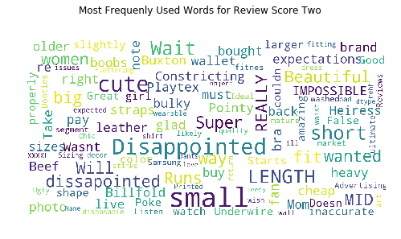

```python
%matplotlib inline
import numpy as np
import pandas as pd
import matplotlib.pyplot as plt
from pandas import DataFrame 
import nltk   ###

from sklearn.neighbors import NearestNeighbors
from sklearn.linear_model import LogisticRegression
from sklearn import neighbors
from scipy.spatial.distance import cosine
from sklearn.metrics import classification_report
from sklearn.metrics import accuracy_score
from sklearn.feature_selection import SelectKBest
from sklearn.feature_extraction.text import CountVectorizer, TfidfTransformer

import re
import string
from wordcloud import WordCloud, STOPWORDS
from sklearn.metrics import mean_squared_error
```


```python
df = pd.read_json("data_amazon.json",lines=True)
```


```python
print(df.columns)
print(df.shape)
```

    Index(['asin', 'helpful', 'overall', 'reviewText', 'reviewTime', 'reviewerID',
           'reviewerName', 'summary', 'unixReviewTime'],
          dtype='object')
    (278677, 9)


### Product Recommendation based on similar reviews/summary


```python
count = df.groupby("asin", as_index=False).count()
mean = df.groupby("asin", as_index=False).mean()

dfMerged = pd.merge(df, count, how='right', on=['asin'])
dfMerged.head()
```


<div>
<style scoped>
    .dataframe tbody tr th:only-of-type {
        vertical-align: middle;
    }

    .dataframe tbody tr th {
        vertical-align: top;
    }

    .dataframe thead th {
        text-align: right;
    }
</style>
<table border="1" class="dataframe">
  <thead>
    <tr style="text-align: right;">
      <th></th>
      <th>asin</th>
      <th>helpful_x</th>
      <th>overall_x</th>
      <th>reviewText_x</th>
      <th>reviewTime_x</th>
      <th>reviewerID_x</th>
      <th>reviewerName_x</th>
      <th>summary_x</th>
      <th>unixReviewTime_x</th>
      <th>helpful_y</th>
      <th>overall_y</th>
      <th>reviewText_y</th>
      <th>reviewTime_y</th>
      <th>reviewerID_y</th>
      <th>reviewerName_y</th>
      <th>summary_y</th>
      <th>unixReviewTime_y</th>
    </tr>
  </thead>
  <tbody>
    <tr>
      <th>0</th>
      <td>0000031887</td>
      <td>[0, 0]</td>
      <td>5</td>
      <td>This is a great tutu and at a really great pri...</td>
      <td>02 12, 2011</td>
      <td>A1KLRMWW2FWPL4</td>
      <td>Amazon Customer "cameramom"</td>
      <td>Great tutu-  not cheaply made</td>
      <td>1297468800</td>
      <td>23</td>
      <td>23</td>
      <td>23</td>
      <td>23</td>
      <td>23</td>
      <td>23</td>
      <td>23</td>
      <td>23</td>
    </tr>
    <tr>
      <th>1</th>
      <td>0000031887</td>
      <td>[0, 0]</td>
      <td>5</td>
      <td>I bought this for my 4 yr old daughter for dan...</td>
      <td>01 19, 2013</td>
      <td>A2G5TCU2WDFZ65</td>
      <td>Amazon Customer</td>
      <td>Very Cute!!</td>
      <td>1358553600</td>
      <td>23</td>
      <td>23</td>
      <td>23</td>
      <td>23</td>
      <td>23</td>
      <td>23</td>
      <td>23</td>
      <td>23</td>
    </tr>
    <tr>
      <th>2</th>
      <td>0000031887</td>
      <td>[0, 0]</td>
      <td>5</td>
      <td>What can I say... my daughters have it in oran...</td>
      <td>01 4, 2013</td>
      <td>A1RLQXYNCMWRWN</td>
      <td>Carola</td>
      <td>I have buy more than one</td>
      <td>1357257600</td>
      <td>23</td>
      <td>23</td>
      <td>23</td>
      <td>23</td>
      <td>23</td>
      <td>23</td>
      <td>23</td>
      <td>23</td>
    </tr>
    <tr>
      <th>3</th>
      <td>0000031887</td>
      <td>[0, 0]</td>
      <td>5</td>
      <td>We bought several tutus at once, and they are ...</td>
      <td>04 27, 2014</td>
      <td>A8U3FAMSJVHS5</td>
      <td>Caromcg</td>
      <td>Adorable, Sturdy</td>
      <td>1398556800</td>
      <td>23</td>
      <td>23</td>
      <td>23</td>
      <td>23</td>
      <td>23</td>
      <td>23</td>
      <td>23</td>
      <td>23</td>
    </tr>
    <tr>
      <th>4</th>
      <td>0000031887</td>
      <td>[0, 0]</td>
      <td>5</td>
      <td>Thank you Halo Heaven great product for Little...</td>
      <td>03 15, 2014</td>
      <td>A3GEOILWLK86XM</td>
      <td>CJ</td>
      <td>Grammy's Angels Love it</td>
      <td>1394841600</td>
      <td>23</td>
      <td>23</td>
      <td>23</td>
      <td>23</td>
      <td>23</td>
      <td>23</td>
      <td>23</td>
      <td>23</td>
    </tr>
  </tbody>
</table>
</div>


```python
#rename column
dfMerged["totalReviewers"] = dfMerged["reviewerID_y"]
dfMerged["overallScore"] = dfMerged["overall_x"]
dfMerged["summaryReview"] = dfMerged["summary_x"]

dfNew = dfMerged[['asin','summaryReview','overallScore',"totalReviewers"]]
```

Selecting products which have more than 80 reviews


```python
dfMerged = dfMerged.sort_values(by='totalReviewers', ascending=False)
dfCount = dfMerged[dfMerged.totalReviewers >= 80]
dfCount.head()
```


<div>
<style scoped>
    .dataframe tbody tr th:only-of-type {
        vertical-align: middle;
    }

    .dataframe tbody tr th {
        vertical-align: top;
    }

    .dataframe thead th {
        text-align: right;
    }
</style>
<table border="1" class="dataframe">
  <thead>
    <tr style="text-align: right;">
      <th></th>
      <th>asin</th>
      <th>helpful_x</th>
      <th>overall_x</th>
      <th>reviewText_x</th>
      <th>reviewTime_x</th>
      <th>reviewerID_x</th>
      <th>reviewerName_x</th>
      <th>summary_x</th>
      <th>unixReviewTime_x</th>
      <th>helpful_y</th>
      <th>overall_y</th>
      <th>reviewText_y</th>
      <th>reviewTime_y</th>
      <th>reviewerID_y</th>
      <th>reviewerName_y</th>
      <th>summary_y</th>
      <th>unixReviewTime_y</th>
      <th>totalReviewers</th>
      <th>overallScore</th>
      <th>summaryReview</th>
    </tr>
  </thead>
  <tbody>
    <tr>
      <th>161700</th>
      <td>B005LERHD8</td>
      <td>[0, 0]</td>
      <td>4</td>
      <td>I was expecting it to be more of a gold tint w...</td>
      <td>01 10, 2013</td>
      <td>A205ZO9KZY2ZD2</td>
      <td>Winnie</td>
      <td>It's ok</td>
      <td>1357776000</td>
      <td>441</td>
      <td>441</td>
      <td>441</td>
      <td>441</td>
      <td>441</td>
      <td>441</td>
      <td>441</td>
      <td>441</td>
      <td>441</td>
      <td>4</td>
      <td>It's ok</td>
    </tr>
    <tr>
      <th>161269</th>
      <td>B005LERHD8</td>
      <td>[0, 0]</td>
      <td>4</td>
      <td>The owl necklace is really cute but made real ...</td>
      <td>07 23, 2012</td>
      <td>A1HFSY6W8LJNJM</td>
      <td>Alicia7tommy "Alicia Andrews"</td>
      <td>Really Cute</td>
      <td>1343001600</td>
      <td>441</td>
      <td>441</td>
      <td>441</td>
      <td>441</td>
      <td>441</td>
      <td>441</td>
      <td>441</td>
      <td>441</td>
      <td>441</td>
      <td>4</td>
      <td>Really Cute</td>
    </tr>
    <tr>
      <th>161280</th>
      <td>B005LERHD8</td>
      <td>[0, 0]</td>
      <td>4</td>
      <td>Very pretty.  A lot bigger than I expected.  I...</td>
      <td>01 11, 2013</td>
      <td>A23L30BKF59BO4</td>
      <td>Amazon Customer</td>
      <td>Very pretty</td>
      <td>1357862400</td>
      <td>441</td>
      <td>441</td>
      <td>441</td>
      <td>441</td>
      <td>441</td>
      <td>441</td>
      <td>441</td>
      <td>441</td>
      <td>441</td>
      <td>4</td>
      <td>Very pretty</td>
    </tr>
    <tr>
      <th>161279</th>
      <td>B005LERHD8</td>
      <td>[0, 0]</td>
      <td>1</td>
      <td>I order xmcheap jewelry on amazon all the tone...</td>
      <td>02 25, 2014</td>
      <td>A1B1YH4TZ326SX</td>
      <td>Amazon Customer</td>
      <td>Not worth your money</td>
      <td>1393286400</td>
      <td>441</td>
      <td>441</td>
      <td>441</td>
      <td>441</td>
      <td>441</td>
      <td>441</td>
      <td>441</td>
      <td>441</td>
      <td>441</td>
      <td>1</td>
      <td>Not worth your money</td>
    </tr>
    <tr>
      <th>161278</th>
      <td>B005LERHD8</td>
      <td>[0, 0]</td>
      <td>5</td>
      <td>I am using it as an acessorie on my first day ...</td>
      <td>08 15, 2013</td>
      <td>A2AEFSWJCJ8Q6P</td>
      <td>Amazon Customer</td>
      <td>Really pretty!</td>
      <td>1376524800</td>
      <td>441</td>
      <td>441</td>
      <td>441</td>
      <td>441</td>
      <td>441</td>
      <td>441</td>
      <td>441</td>
      <td>441</td>
      <td>441</td>
      <td>5</td>
      <td>Really pretty!</td>
    </tr>
  </tbody>
</table>
</div>


```python
dfCount.shape
```


    (18758, 20)


```python
dfCount['totalReviewers'].describe()
```


    count    18758.000000
    mean       141.044781
    std         65.695438
    min         80.000000
    25%         94.000000
    50%        123.000000
    75%        162.000000
    max        441.000000
    Name: totalReviewers, dtype: float64


### Grouping all the summary Reviews by product ID


```python
dfProductReview = df.groupby("asin", as_index=False).mean()
ProductReviewSummary = dfCount.groupby("asin")["summaryReview"].apply(str)
ProductReviewSummary = pd.DataFrame(ProductReviewSummary)
ProductReviewSummary.head()
```


<div>
<style scoped>
    .dataframe tbody tr th:only-of-type {
        vertical-align: middle;
    }

    .dataframe tbody tr th {
        vertical-align: top;
    }

    .dataframe thead th {
        text-align: right;
    }
</style>
<table border="1" class="dataframe">
  <thead>
    <tr style="text-align: right;">
      <th></th>
      <th>summaryReview</th>
    </tr>
    <tr>
      <th>asin</th>
      <th></th>
    </tr>
  </thead>
  <tbody>
    <tr>
      <th>B00006XXGO</th>
      <td>243                                  Great Pai...</td>
    </tr>
    <tr>
      <th>B000072UMJ</th>
      <td>359                                           ...</td>
    </tr>
    <tr>
      <th>B0000ANHST</th>
      <td>1558                It's a carhartt what more ...</td>
    </tr>
    <tr>
      <th>B0000C321X</th>
      <td>2270                                  NIce fit...</td>
    </tr>
    <tr>
      <th>B00012O12A</th>
      <td>3667                                          ...</td>
    </tr>
  </tbody>
</table>
</div>


```python
print(dfProductReview.shape)
print(ProductReviewSummary.shape)
dfProductReview.head()
```

    (23033, 3)
    (153, 1)


<div>
<style scoped>
    .dataframe tbody tr th:only-of-type {
        vertical-align: middle;
    }

    .dataframe tbody tr th {
        vertical-align: top;
    }

    .dataframe thead th {
        text-align: right;
    }
</style>
<table border="1" class="dataframe">
  <thead>
    <tr style="text-align: right;">
      <th></th>
      <th>asin</th>
      <th>overall</th>
      <th>unixReviewTime</th>
    </tr>
  </thead>
  <tbody>
    <tr>
      <th>0</th>
      <td>0000031887</td>
      <td>4.608696</td>
      <td>1.370064e+09</td>
    </tr>
    <tr>
      <th>1</th>
      <td>0123456479</td>
      <td>4.166667</td>
      <td>1.382947e+09</td>
    </tr>
    <tr>
      <th>2</th>
      <td>1608299953</td>
      <td>4.307692</td>
      <td>1.307637e+09</td>
    </tr>
    <tr>
      <th>3</th>
      <td>1617160377</td>
      <td>4.625000</td>
      <td>1.321078e+09</td>
    </tr>
    <tr>
      <th>4</th>
      <td>B00001W0KA</td>
      <td>4.625000</td>
      <td>1.349492e+09</td>
    </tr>
  </tbody>
</table>
</div>


### create dataframe with certain columns


```python
df3 = pd.merge(ProductReviewSummary, dfProductReview, on="asin", how='inner')
```


```python
df3 = df3[['asin','summaryReview','overall']]
```

### Text Cleaning - Summary column


```python
df3.head()
```


<div>
<style scoped>
    .dataframe tbody tr th:only-of-type {
        vertical-align: middle;
    }

    .dataframe tbody tr th {
        vertical-align: top;
    }

    .dataframe thead th {
        text-align: right;
    }
</style>
<table border="1" class="dataframe">
  <thead>
    <tr style="text-align: right;">
      <th></th>
      <th>asin</th>
      <th>summaryReview</th>
      <th>overall</th>
    </tr>
  </thead>
  <tbody>
    <tr>
      <th>0</th>
      <td>B00006XXGO</td>
      <td>243                                  Great Pai...</td>
      <td>4.666667</td>
    </tr>
    <tr>
      <th>1</th>
      <td>B000072UMJ</td>
      <td>359                                           ...</td>
      <td>4.594595</td>
    </tr>
    <tr>
      <th>2</th>
      <td>B0000ANHST</td>
      <td>1558                It's a carhartt what more ...</td>
      <td>4.487179</td>
    </tr>
    <tr>
      <th>3</th>
      <td>B0000C321X</td>
      <td>2270                                  NIce fit...</td>
      <td>4.263415</td>
    </tr>
    <tr>
      <th>4</th>
      <td>B00012O12A</td>
      <td>3667                                          ...</td>
      <td>4.153439</td>
    </tr>
  </tbody>
</table>
</div>


```python
#function for tokenizing summary
regEx = re.compile('[^a-zA-Z]+')
def cleanReviews(reviewText):
    reviewText = regEx.sub(' ', reviewText).strip()
    return reviewText
```


```python
#reset index and drop duplicate rows
df3["summaryClean"] = df3["summaryReview"].apply(cleanReviews)
# df3 = df3.drop_duplicates(['overall'], keep='last')
# df3 = df3.reset_index()
```


```python
reviews = df3["summaryClean"] 
countVector = CountVectorizer(max_features = 300, stop_words='english') 
transformedReviews = countVector.fit_transform(reviews) 

dfReviews = DataFrame(transformedReviews.A, columns=countVector.get_feature_names())
dfReviews = dfReviews.astype(int)
```


```python
# #save 
# dfReviews.to_csv("dfReviews.csv")
```


```python
# import random
# First let's create a dataset called X
X = np.array(dfReviews)
# create train and test
tpercent = 0.85
np.random.seed(9)
tsize = int(np.floor(tpercent * len(dfReviews)))
i_x=np.random.rand(len(dfReviews))<tpercent
dfReviews_train = X[i_x]
dfReviews_test = X[~i_x]
# len of train and test
lentrain = len(dfReviews_train)
lentest = len(dfReviews_test)
```


```python
# KNN classifier to find similar products
print(lentrain)
print(lentest)
```

    132
    21


```python
neighbor = NearestNeighbors(n_neighbors=3, algorithm='ball_tree').fit(dfReviews_train)

# Let's find the k-neighbors of each point in object X. To do that we call the kneighbors() function on object X.
distances, indices = neighbor.kneighbors(dfReviews_train)
```


```python
#find most related products
m=0
for i in ~i_x:
    if i==True:
        a = neighbor.kneighbors([X[m]])
        related_product_list = a[1] #index of product we bought
        first_related_product = [item[0] for item in related_product_list]
        first_related_product = str(first_related_product).strip('[]')
        first_related_product = int(first_related_product)
        second_related_product = [item[1] for item in related_product_list]
        second_related_product = str(second_related_product).strip('[]')
        second_related_product = int(second_related_product)

        print ("Based on product reviews, for ", df3["asin"][m] ," average rating is ",df3["overall"][m])
        print ("The first similar product is ", df3["asin"][first_related_product] ," average rating is ",df3["overall"][first_related_product])
        print ("The second similar product is ", df3["asin"][second_related_product] ," average rating is ",df3["overall"][second_related_product])
        print ("-----------------------------------------------------------")
        
    m+=1
```

    Based on product reviews, for  B0007XA0FU  average rating is  4.204301075268817
    The first similar product is  B00006XXGO  average rating is  4.666666666666667
    The second similar product is  B007WADJ7M  average rating is  3.449438202247191
    -----------------------------------------------------------
    Based on product reviews, for  B0007YR8WW  average rating is  4.005405405405406
    The first similar product is  B0007YR8WW  average rating is  4.005405405405406
    The second similar product is  B000KKTPD8  average rating is  4.2727272727272725
    -----------------------------------------------------------
    Based on product reviews, for  B0008EOEPK  average rating is  4.559139784946237
    The first similar product is  B0007XA0FU  average rating is  4.204301075268817
    The second similar product is  B000T9VK56  average rating is  3.8405797101449277
    -----------------------------------------------------------
    Based on product reviews, for  B000FH4JJQ  average rating is  4.536363636363636
    The first similar product is  B0009F0Z38  average rating is  4.526315789473684
    The second similar product is  B000DZUGOM  average rating is  4.563492063492063
    -----------------------------------------------------------
    Based on product reviews, for  B000GPGWZG  average rating is  4.2439024390243905
    The first similar product is  B000KKTPD8  average rating is  4.2727272727272725
    The second similar product is  B0007YR8WW  average rating is  4.005405405405406
    -----------------------------------------------------------
    Based on product reviews, for  B000KD44G8  average rating is  4.285714285714286
    The first similar product is  B002K6F79G  average rating is  3.4408602150537635
    The second similar product is  B003XDVUEQ  average rating is  4.351351351351352
    -----------------------------------------------------------
    Based on product reviews, for  B000KGOHLM  average rating is  4.666666666666667
    The first similar product is  B003YBHE5Q  average rating is  4.125
    The second similar product is  B007WADJ7M  average rating is  3.449438202247191
    -----------------------------------------------------------
    Based on product reviews, for  B000KKTPD8  average rating is  4.2727272727272725
    The first similar product is  B003YBHE5Q  average rating is  4.125
    The second similar product is  B005LERHD8  average rating is  4.290249433106576
    -----------------------------------------------------------
    Based on product reviews, for  B000MXIMHI  average rating is  4.414141414141414
    The first similar product is  B000VK2LJC  average rating is  3.865168539325843
    The second similar product is  B0051D7GF8  average rating is  4.078431372549019
    -----------------------------------------------------------
    Based on product reviews, for  B000O32MLI  average rating is  4.513812154696133
    The first similar product is  B0029HQLP0  average rating is  4.182926829268292
    The second similar product is  B0026P45QW  average rating is  4.371681415929204
    -----------------------------------------------------------
    Based on product reviews, for  B000XV7ORI  average rating is  4.183908045977011
    The first similar product is  B000O32MLI  average rating is  4.513812154696133
    The second similar product is  B0013KDS96  average rating is  4.781512605042017
    -----------------------------------------------------------
    Based on product reviews, for  B0012QM8IS  average rating is  3.871559633027523
    The first similar product is  B0013KDS96  average rating is  4.781512605042017
    The second similar product is  B004Z1CZDK  average rating is  3.1923076923076925
    -----------------------------------------------------------
    Based on product reviews, for  B002APTA9K  average rating is  4.509803921568627
    The first similar product is  B003NX87U6  average rating is  4.398809523809524
    The second similar product is  B000VK2LJC  average rating is  3.865168539325843
    -----------------------------------------------------------
    Based on product reviews, for  B004R1II48  average rating is  4.055555555555555
    The first similar product is  B007WADJ7M  average rating is  3.449438202247191
    The second similar product is  B004Q7AB4I  average rating is  4.337142857142857
    -----------------------------------------------------------
    Based on product reviews, for  B005ZEWGSA  average rating is  4.432098765432099
    The first similar product is  B000KGOHLM  average rating is  4.666666666666667
    The second similar product is  B003YBHE5Q  average rating is  4.125
    -----------------------------------------------------------
    Based on product reviews, for  B007KQRSZM  average rating is  3.4457831325301207
    The first similar product is  B007WA2Q5I  average rating is  3.688888888888889
    The second similar product is  B008RKYS44  average rating is  4.35
    -----------------------------------------------------------
    Based on product reviews, for  B007NLX16O  average rating is  4.507936507936508
    The first similar product is  B007DLVLAW  average rating is  4.587628865979381
    The second similar product is  B007WADJ7M  average rating is  3.449438202247191
    -----------------------------------------------------------
    Based on product reviews, for  B008RKYS44  average rating is  4.35
    The first similar product is  B008RKYS44  average rating is  4.35
    The second similar product is  B005VNFCZO  average rating is  4.362637362637362
    -----------------------------------------------------------
    Based on product reviews, for  B008UKZ868  average rating is  4.117647058823529
    The first similar product is  B008RKYS44  average rating is  4.35
    The second similar product is  B0083S18LQ  average rating is  3.9565217391304346
    -----------------------------------------------------------
    Based on product reviews, for  B009ZDEXQK  average rating is  4.7254901960784315
    The first similar product is  B003YJBYIQ  average rating is  4.355555555555555
    The second similar product is  B000MM8I5U  average rating is  4.094117647058823
    -----------------------------------------------------------
    Based on product reviews, for  B00DMWQV38  average rating is  3.63953488372093
    The first similar product is  B007WA2Q5I  average rating is  3.688888888888889
    The second similar product is  B008RKYS44  average rating is  4.35
    -----------------------------------------------------------


```python
print ("Based on product reviews, for ", df3["asin"][117] ," average rating is ",df3["overall"][117])
print ("The first similar product is ", df3["asin"][first_related_product] ," average rating is ",df3["overall"][first_related_product])
print ("The second similar product is ", df3["asin"][second_related_product] ," average rating is ",df3["overall"][second_related_product])
print ("-----------------------------------------------------------")
```

    Based on product reviews, for  B007WA2Q5I  average rating is  3.688888888888889
    The first similar product is  B007WA2Q5I  average rating is  3.688888888888889
    The second similar product is  B008RKYS44  average rating is  4.35
    -----------------------------------------------------------


```python
xc='hai!!!! apa kabar'
xc = cleanReviews(xc)
xc=[xc]
xc=countVector.transform(xc)
xc=DataFrame(xc.A, columns=countVector.get_feature_names())
neighbor.kneighbors(xc)
```


    (array([[12.28820573, 13.34166406, 14.07124728]]), array([[ 76, 127,  30]]))


```python
inputy='Nice Shoes, good material worth every penny'
inputy=[inputy]
xxy=countVector.transform(inputy)
xxy=DataFrame(xxy.A, columns=countVector.get_feature_names())
neighbor.kneighbors(xxy)
xxy
```


<div>
<style scoped>
    .dataframe tbody tr th:only-of-type {
        vertical-align: middle;
    }

    .dataframe tbody tr th {
        vertical-align: top;
    }

    .dataframe thead th {
        text-align: right;
    }
</style>
<table border="1" class="dataframe">
  <thead>
    <tr style="text-align: right;">
      <th></th>
      <th>absolutely</th>
      <th>adorable</th>
      <th>allegra</th>
      <th>amazing</th>
      <th>amazon</th>
      <th>arch</th>
      <th>attractive</th>
      <th>awesome</th>
      <th>backpack</th>
      <th>bad</th>
      <th>...</th>
      <th>wish</th>
      <th>women</th>
      <th>wonderful</th>
      <th>work</th>
      <th>workout</th>
      <th>works</th>
      <th>worth</th>
      <th>wow</th>
      <th>wrong</th>
      <th>yoga</th>
    </tr>
  </thead>
  <tbody>
    <tr>
      <th>0</th>
      <td>0</td>
      <td>0</td>
      <td>0</td>
      <td>0</td>
      <td>0</td>
      <td>0</td>
      <td>0</td>
      <td>0</td>
      <td>0</td>
      <td>0</td>
      <td>...</td>
      <td>0</td>
      <td>0</td>
      <td>0</td>
      <td>0</td>
      <td>0</td>
      <td>0</td>
      <td>1</td>
      <td>0</td>
      <td>0</td>
      <td>0</td>
    </tr>
  </tbody>
</table>
<p>1 rows × 300 columns</p>
</div>


### Predicting Review Score


```python
df5_train_target = df3["overall"][i_x]
df5_test_target = df3["overall"][~i_x]
df5_train_target = df5_train_target.astype(int)
df5_test_target = df5_test_target.astype(int)

n_neighbors = 3
knnclf = neighbors.KNeighborsClassifier(n_neighbors, weights='distance')
knnclf.fit(dfReviews_train, df5_train_target)
knnpreds_test = knnclf.predict(dfReviews_test)

print(classification_report(df5_test_target, knnpreds_test))
```

                  precision    recall  f1-score   support
    
               3       0.50      0.33      0.40         3
               4       0.89      0.94      0.92        18
    
       micro avg       0.86      0.86      0.86        21
       macro avg       0.70      0.64      0.66        21
    weighted avg       0.84      0.86      0.84        21
    


### Accuracy of the model


```python
print (accuracy_score(df5_test_target, knnpreds_test))
```

    0.8571428571428571


```python
print(mean_squared_error(df5_test_target, knnpreds_test))
```

    0.14285714285714285


### Predicting Review Score with k = rule of thumb


```python
if round(lentrain**0.5)%2==0:
    co=round(lentrain**0.5)+1
else:
    co=round(lentrain**0.5)
co
```


    11


```python
knncl5 = neighbors.KNeighborsClassifier(co, weights='distance')
knncl5.fit(dfReviews_train, df5_train_target)
knnpred5_test = knncl5.predict(dfReviews_test)
print(classification_report(df5_test_target, knnpred5_test))
```

                  precision    recall  f1-score   support
    
               3       1.00      0.33      0.50         3
               4       0.90      1.00      0.95        18
    
       micro avg       0.90      0.90      0.90        21
       macro avg       0.95      0.67      0.72        21
    weighted avg       0.91      0.90      0.88        21
    


```python
print (accuracy_score(df5_test_target, knnpred5_test))
```

    0.9047619047619048


```python
print(mean_squared_error(df5_test_target, knnpred5_test))
```

    0.09523809523809523


### Word correlatation based on cluster


```python
cluster = df.groupby("overall")["summary"].apply(str)
cluster = pd.DataFrame(cluster)
cluster["summaryClean"] = cluster["summary"].apply(cleanReviews)
cluster
```


<div>
<style scoped>
    .dataframe tbody tr th:only-of-type {
        vertical-align: middle;
    }

    .dataframe tbody tr th {
        vertical-align: top;
    }

    .dataframe thead th {
        text-align: right;
    }
</style>
<table border="1" class="dataframe">
  <thead>
    <tr style="text-align: right;">
      <th></th>
      <th>summary</th>
      <th>summaryClean</th>
    </tr>
    <tr>
      <th>overall</th>
      <th></th>
      <th></th>
    </tr>
  </thead>
  <tbody>
    <tr>
      <th>1</th>
      <td>17                                         Nev...</td>
      <td>Never GOT IT DO NOT BUY IF YOU EVER WANT TO RE...</td>
    </tr>
    <tr>
      <th>2</th>
      <td>106                                           ...</td>
      <td>too short I m glad i bought back up straps Dis...</td>
    </tr>
    <tr>
      <th>3</th>
      <td>15                                    Came apa...</td>
      <td>Came apart in weeks Arrived with a defect Nice...</td>
    </tr>
    <tr>
      <th>4</th>
      <td>5                                             ...</td>
      <td>It s ok Good Practically Perfect in every way ...</td>
    </tr>
    <tr>
      <th>5</th>
      <td>0                             Great tutu-  not...</td>
      <td>Great tutu not cheaply made Very Cute I have b...</td>
    </tr>
  </tbody>
</table>
</div>


### World Clouding for Each Score Group


```python
stopwords = set(STOPWORDS)

def show_wordcloud(data, title = None):
    wordcloud = WordCloud(
        background_color='white',
        stopwords=stopwords,
        max_words=500,
        max_font_size=30, 
        scale=3,
        random_state=1 # chosen at random by flipping a coin; it was heads
    ).generate(str(data))
    
    fig = plt.figure(1, figsize=(8, 8))
    plt.axis('off')
    if title: 
        fig.suptitle(title, fontsize=12)
        fig.subplots_adjust(top=1.3)
    plt.imshow(wordcloud)
    plt.show()
```


```python
show_wordcloud(cluster.iloc[0,1], title = "Most Frequenly Used Words for Review Score One")
```


```python
show_wordcloud(cluster["summaryClean"][2] , title = "Most Frequenly Used Words for Review Score Two")
```





```python
show_wordcloud(cluster["summaryClean"][3], title = "Most Frequenly Used Words for Review Score Three")
```


```python
show_wordcloud(cluster["summaryClean"][4], title = 'Most Frequenly Used Words for Review Score Four')
```


```python
show_wordcloud(cluster["summaryClean"][5], title = "Most Frequenly Used Words for Review Score Five")
```


