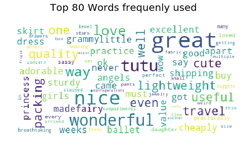
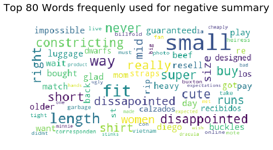
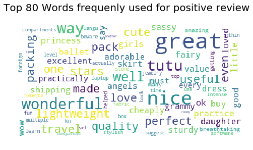
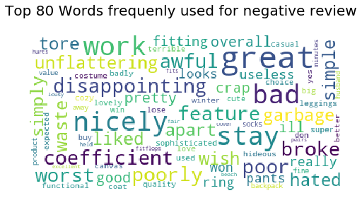
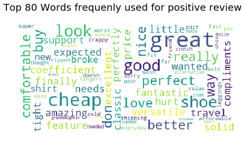

dataset available at http://jmcauley.ucsd.edu/data/amazon/. We choose to analyse how customer feedback from clothing departement is, 
where  
* reviewerID - ID of the reviewer, e.g. A2SUAM1J3GNN3B  
* asin - ID of the product, e.g. 0000013714  
* reviewerName - name of the reviewer  
* helpful - helpfulness rating of the review, e.g. 2/3  
* reviewText - text of the review  
* overall - rating of the product  
* summary - summary of the review  
* unixReviewTime - time of the review (unix time)  
* reviewTime - time of the review (raw)  


# Data Preparation
import the libraries that we need and the data, transform data into new feature that we want


```python
import numpy as np
import scipy as sp
import pandas as pd
%matplotlib inline
import matplotlib.pyplot as plt
from collections import defaultdict
from sklearn.feature_extraction.text import CountVectorizer, TfidfTransformer
from sklearn.model_selection import train_test_split
from sklearn import linear_model
```


```python
#Read the file and add new columns helpfulnessnumerator and helpfulnessdenominator, so we can measure how helpful the review is
reviews = pd.read_json('data_amazon.json',lines=True)
reviews[['Helpful','Total_whethernot_helpful']] = pd.DataFrame(reviews.helpful.values.tolist(), index = reviews.index)
```


```python
reviews.shape
```


    (278677, 11)


```python
reviews.head()
```


<div>
<style scoped>
    .dataframe tbody tr th:only-of-type {
        vertical-align: middle;
    }

    .dataframe tbody tr th {
        vertical-align: top;
    }

    .dataframe thead th {
        text-align: right;
    }
</style>
<table border="1" class="dataframe">
  <thead>
    <tr style="text-align: right;">
      <th></th>
      <th>asin</th>
      <th>helpful</th>
      <th>overall</th>
      <th>reviewText</th>
      <th>reviewTime</th>
      <th>reviewerID</th>
      <th>reviewerName</th>
      <th>summary</th>
      <th>unixReviewTime</th>
      <th>Helpful</th>
      <th>Total_whethernot_helpful</th>
    </tr>
  </thead>
  <tbody>
    <tr>
      <th>0</th>
      <td>0000031887</td>
      <td>[0, 0]</td>
      <td>5</td>
      <td>This is a great tutu and at a really great pri...</td>
      <td>02 12, 2011</td>
      <td>A1KLRMWW2FWPL4</td>
      <td>Amazon Customer "cameramom"</td>
      <td>Great tutu-  not cheaply made</td>
      <td>1297468800</td>
      <td>0</td>
      <td>0</td>
    </tr>
    <tr>
      <th>1</th>
      <td>0000031887</td>
      <td>[0, 0]</td>
      <td>5</td>
      <td>I bought this for my 4 yr old daughter for dan...</td>
      <td>01 19, 2013</td>
      <td>A2G5TCU2WDFZ65</td>
      <td>Amazon Customer</td>
      <td>Very Cute!!</td>
      <td>1358553600</td>
      <td>0</td>
      <td>0</td>
    </tr>
    <tr>
      <th>2</th>
      <td>0000031887</td>
      <td>[0, 0]</td>
      <td>5</td>
      <td>What can I say... my daughters have it in oran...</td>
      <td>01 4, 2013</td>
      <td>A1RLQXYNCMWRWN</td>
      <td>Carola</td>
      <td>I have buy more than one</td>
      <td>1357257600</td>
      <td>0</td>
      <td>0</td>
    </tr>
    <tr>
      <th>3</th>
      <td>0000031887</td>
      <td>[0, 0]</td>
      <td>5</td>
      <td>We bought several tutus at once, and they are ...</td>
      <td>04 27, 2014</td>
      <td>A8U3FAMSJVHS5</td>
      <td>Caromcg</td>
      <td>Adorable, Sturdy</td>
      <td>1398556800</td>
      <td>0</td>
      <td>0</td>
    </tr>
    <tr>
      <th>4</th>
      <td>0000031887</td>
      <td>[0, 0]</td>
      <td>5</td>
      <td>Thank you Halo Heaven great product for Little...</td>
      <td>03 15, 2014</td>
      <td>A3GEOILWLK86XM</td>
      <td>CJ</td>
      <td>Grammy's Angels Love it</td>
      <td>1394841600</td>
      <td>0</td>
      <td>0</td>
    </tr>
  </tbody>
</table>
</div>


```python
#Cleaning the data by eliminating duplicates
reviews.drop_duplicates(subset=['reviewerID', 'asin','unixReviewTime'],inplace=True)

#Adding the helpfulness and upvote percentages for metrics
reviews['Helpful %'] = np.where(reviews['Total_whethernot_helpful'] > 0, reviews['Helpful'] / reviews['Total_whethernot_helpful'], -1)
reviews['% Upvote'] = pd.cut(reviews['Helpful %'], bins = [-1, 0, 0.2, 0.4, 0.6, 0.8, 1.0], labels = ['Empty', '0-20%', '20-40%', '40-60%', '60-80%', '80-100%'], include_lowest = True)
reviews['Id'] = reviews.index;
reviews
```


<div>
<style scoped>
    .dataframe tbody tr th:only-of-type {
        vertical-align: middle;
    }

    .dataframe tbody tr th {
        vertical-align: top;
    }

    .dataframe thead th {
        text-align: right;
    }
</style>
<table border="1" class="dataframe">
  <thead>
    <tr style="text-align: right;">
      <th></th>
      <th>asin</th>
      <th>helpful</th>
      <th>overall</th>
      <th>reviewText</th>
      <th>reviewTime</th>
      <th>reviewerID</th>
      <th>reviewerName</th>
      <th>summary</th>
      <th>unixReviewTime</th>
      <th>Helpful</th>
      <th>Total_whethernot_helpful</th>
      <th>Helpful %</th>
      <th>% Upvote</th>
      <th>Id</th>
      <th>usefulScore</th>
    </tr>
  </thead>
  <tbody>
    <tr>
      <th>0</th>
      <td>0000031887</td>
      <td>[0, 0]</td>
      <td>5</td>
      <td>This is a great tutu and at a really great pri...</td>
      <td>02 12, 2011</td>
      <td>A1KLRMWW2FWPL4</td>
      <td>Amazon Customer "cameramom"</td>
      <td>Great tutu-  not cheaply made</td>
      <td>1297468800</td>
      <td>0</td>
      <td>0</td>
      <td>-1.000000</td>
      <td>Empty</td>
      <td>0</td>
      <td>useless</td>
    </tr>
    <tr>
      <th>1</th>
      <td>0000031887</td>
      <td>[0, 0]</td>
      <td>5</td>
      <td>I bought this for my 4 yr old daughter for dan...</td>
      <td>01 19, 2013</td>
      <td>A2G5TCU2WDFZ65</td>
      <td>Amazon Customer</td>
      <td>Very Cute!!</td>
      <td>1358553600</td>
      <td>0</td>
      <td>0</td>
      <td>-1.000000</td>
      <td>Empty</td>
      <td>1</td>
      <td>useless</td>
    </tr>
    <tr>
      <th>2</th>
      <td>0000031887</td>
      <td>[0, 0]</td>
      <td>5</td>
      <td>What can I say... my daughters have it in oran...</td>
      <td>01 4, 2013</td>
      <td>A1RLQXYNCMWRWN</td>
      <td>Carola</td>
      <td>I have buy more than one</td>
      <td>1357257600</td>
      <td>0</td>
      <td>0</td>
      <td>-1.000000</td>
      <td>Empty</td>
      <td>2</td>
      <td>useless</td>
    </tr>
    <tr>
      <th>3</th>
      <td>0000031887</td>
      <td>[0, 0]</td>
      <td>5</td>
      <td>We bought several tutus at once, and they are ...</td>
      <td>04 27, 2014</td>
      <td>A8U3FAMSJVHS5</td>
      <td>Caromcg</td>
      <td>Adorable, Sturdy</td>
      <td>1398556800</td>
      <td>0</td>
      <td>0</td>
      <td>-1.000000</td>
      <td>Empty</td>
      <td>3</td>
      <td>useless</td>
    </tr>
    <tr>
      <th>4</th>
      <td>0000031887</td>
      <td>[0, 0]</td>
      <td>5</td>
      <td>Thank you Halo Heaven great product for Little...</td>
      <td>03 15, 2014</td>
      <td>A3GEOILWLK86XM</td>
      <td>CJ</td>
      <td>Grammy's Angels Love it</td>
      <td>1394841600</td>
      <td>0</td>
      <td>0</td>
      <td>-1.000000</td>
      <td>Empty</td>
      <td>4</td>
      <td>useless</td>
    </tr>
    <tr>
      <th>5</th>
      <td>0000031887</td>
      <td>[0, 0]</td>
      <td>4</td>
      <td>I received this today and I'm not a fan of it ...</td>
      <td>03 31, 2014</td>
      <td>A27UF1MSF3DB2</td>
      <td>C-Lo "Cynthia"</td>
      <td>It's ok</td>
      <td>1396224000</td>
      <td>0</td>
      <td>0</td>
      <td>-1.000000</td>
      <td>Empty</td>
      <td>5</td>
      <td>useless</td>
    </tr>
    <tr>
      <th>6</th>
      <td>0000031887</td>
      <td>[0, 0]</td>
      <td>5</td>
      <td>Bought this as a backup to the regular ballet ...</td>
      <td>05 3, 2014</td>
      <td>A16GFPNVF4Y816</td>
      <td>design maven</td>
      <td>Great for dress-up and for ballet practice</td>
      <td>1399075200</td>
      <td>0</td>
      <td>0</td>
      <td>-1.000000</td>
      <td>Empty</td>
      <td>6</td>
      <td>useless</td>
    </tr>
    <tr>
      <th>7</th>
      <td>0000031887</td>
      <td>[0, 0]</td>
      <td>5</td>
      <td>Great tutu for a great price. It isn't a &amp;#34;...</td>
      <td>12 23, 2012</td>
      <td>A2M2APVYIB2U6K</td>
      <td>Jamie P.</td>
      <td>Great value</td>
      <td>1356220800</td>
      <td>0</td>
      <td>0</td>
      <td>-1.000000</td>
      <td>Empty</td>
      <td>7</td>
      <td>useless</td>
    </tr>
    <tr>
      <th>8</th>
      <td>0000031887</td>
      <td>[0, 0]</td>
      <td>4</td>
      <td>My daughter liked this, and it with her costum...</td>
      <td>11 10, 2013</td>
      <td>A1NJ71X3YPQNQ9</td>
      <td>JBerger</td>
      <td>Good</td>
      <td>1384041600</td>
      <td>0</td>
      <td>0</td>
      <td>-1.000000</td>
      <td>Empty</td>
      <td>8</td>
      <td>useless</td>
    </tr>
    <tr>
      <th>9</th>
      <td>0000031887</td>
      <td>[7, 8]</td>
      <td>5</td>
      <td>For what I paid for two tutus is unbeatable an...</td>
      <td>10 7, 2012</td>
      <td>A3EERSWHAI6SO</td>
      <td>Jeffrey Hollingshead "Jillian hollingshead"</td>
      <td>WOW !! ..is all I have to say!</td>
      <td>1349568000</td>
      <td>7</td>
      <td>8</td>
      <td>0.875000</td>
      <td>80-100%</td>
      <td>9</td>
      <td>useful</td>
    </tr>
    <tr>
      <th>10</th>
      <td>0000031887</td>
      <td>[0, 0]</td>
      <td>5</td>
      <td>Wonder my niece wears it every single day, yel...</td>
      <td>01 2, 2014</td>
      <td>AX1QE6IR7CHXM</td>
      <td>JJ</td>
      <td>Wonderful and great shipping.</td>
      <td>1388620800</td>
      <td>0</td>
      <td>0</td>
      <td>-1.000000</td>
      <td>Empty</td>
      <td>10</td>
      <td>useless</td>
    </tr>
    <tr>
      <th>11</th>
      <td>0000031887</td>
      <td>[0, 0]</td>
      <td>5</td>
      <td>My daughter has worn this skirt almost every d...</td>
      <td>01 30, 2014</td>
      <td>A2A2WZYLU528RO</td>
      <td>Julie Gayler</td>
      <td>Excellent quality!</td>
      <td>1391040000</td>
      <td>0</td>
      <td>0</td>
      <td>-1.000000</td>
      <td>Empty</td>
      <td>11</td>
      <td>useless</td>
    </tr>
    <tr>
      <th>12</th>
      <td>0000031887</td>
      <td>[0, 0]</td>
      <td>5</td>
      <td>Purchased this tutu for my granddaughter's fir...</td>
      <td>11 12, 2011</td>
      <td>A391EXIT5TFP72</td>
      <td>Lisbeth Starr</td>
      <td>Wonderful tutu!</td>
      <td>1321056000</td>
      <td>0</td>
      <td>0</td>
      <td>-1.000000</td>
      <td>Empty</td>
      <td>12</td>
      <td>useless</td>
    </tr>
    <tr>
      <th>13</th>
      <td>0000031887</td>
      <td>[1, 1]</td>
      <td>5</td>
      <td>Full and well stitched.  This tutu is a beauti...</td>
      <td>02 24, 2013</td>
      <td>A34ATJR9KFIXL9</td>
      <td>Maudy1</td>
      <td>Great Tutu</td>
      <td>1361664000</td>
      <td>1</td>
      <td>1</td>
      <td>1.000000</td>
      <td>80-100%</td>
      <td>13</td>
      <td>useful</td>
    </tr>
    <tr>
      <th>14</th>
      <td>0000031887</td>
      <td>[0, 0]</td>
      <td>5</td>
      <td>This was a gift for a two year old and a five ...</td>
      <td>07 1, 2013</td>
      <td>AJ6B83I4YJHYW</td>
      <td>M. Davis</td>
      <td>Great tutu for little girls!</td>
      <td>1372636800</td>
      <td>0</td>
      <td>0</td>
      <td>-1.000000</td>
      <td>Empty</td>
      <td>14</td>
      <td>useless</td>
    </tr>
    <tr>
      <th>15</th>
      <td>0000031887</td>
      <td>[0, 0]</td>
      <td>3</td>
      <td>My 3yr old loved this tutu skirt in pink! Was ...</td>
      <td>03 20, 2014</td>
      <td>A26A4KKLAVTMCC</td>
      <td>Moonlight</td>
      <td>Came apart in 2weeks!</td>
      <td>1395273600</td>
      <td>0</td>
      <td>0</td>
      <td>-1.000000</td>
      <td>Empty</td>
      <td>15</td>
      <td>useless</td>
    </tr>
    <tr>
      <th>16</th>
      <td>0000031887</td>
      <td>[0, 0]</td>
      <td>5</td>
      <td>Perfect for my budding grand daughter ballerin...</td>
      <td>04 27, 2013</td>
      <td>A1MXJVYXE2QU6H</td>
      <td>Mother Goose "WI Grandma"</td>
      <td>So cute!</td>
      <td>1367020800</td>
      <td>0</td>
      <td>0</td>
      <td>-1.000000</td>
      <td>Empty</td>
      <td>16</td>
      <td>useless</td>
    </tr>
    <tr>
      <th>17</th>
      <td>0000031887</td>
      <td>[0, 0]</td>
      <td>1</td>
      <td>Never GOT this item - but gave a 1 STAR becaus...</td>
      <td>05 12, 2014</td>
      <td>A2XJ13PIXVJFJH</td>
      <td>Myra MLH "Myra MLH"</td>
      <td>Never GOT IT....</td>
      <td>1399852800</td>
      <td>0</td>
      <td>0</td>
      <td>-1.000000</td>
      <td>Empty</td>
      <td>17</td>
      <td>useless</td>
    </tr>
    <tr>
      <th>18</th>
      <td>0000031887</td>
      <td>[0, 0]</td>
      <td>5</td>
      <td>Nice and puffy tutu skirt. I would recommend t...</td>
      <td>12 24, 2013</td>
      <td>A287XY94U7JDM8</td>
      <td>Natasha</td>
      <td>Nice skirt</td>
      <td>1387843200</td>
      <td>0</td>
      <td>0</td>
      <td>-1.000000</td>
      <td>Empty</td>
      <td>18</td>
      <td>useless</td>
    </tr>
    <tr>
      <th>19</th>
      <td>0000031887</td>
      <td>[0, 0]</td>
      <td>5</td>
      <td>Bought this for my niece as part of her fairy ...</td>
      <td>01 30, 2013</td>
      <td>A1JR9KKF6UKUWW</td>
      <td>Queens Meadow</td>
      <td>must have for a fairy princess</td>
      <td>1359504000</td>
      <td>0</td>
      <td>0</td>
      <td>-1.000000</td>
      <td>Empty</td>
      <td>19</td>
      <td>useless</td>
    </tr>
    <tr>
      <th>20</th>
      <td>0000031887</td>
      <td>[0, 0]</td>
      <td>5</td>
      <td>My 4 year old daughter always wants to play dr...</td>
      <td>10 24, 2012</td>
      <td>A2SX7X8QGQVCJU</td>
      <td>Shannon</td>
      <td>My daughter loved it</td>
      <td>1351036800</td>
      <td>0</td>
      <td>0</td>
      <td>-1.000000</td>
      <td>Empty</td>
      <td>20</td>
      <td>useless</td>
    </tr>
    <tr>
      <th>21</th>
      <td>0000031887</td>
      <td>[0, 0]</td>
      <td>5</td>
      <td>Our granddaughters are all very girlie, so whe...</td>
      <td>01 19, 2013</td>
      <td>A2Q6UWR5PBHTJS</td>
      <td>Sylvia "Sylvia"</td>
      <td>Sassy!</td>
      <td>1358553600</td>
      <td>0</td>
      <td>0</td>
      <td>-1.000000</td>
      <td>Empty</td>
      <td>21</td>
      <td>useless</td>
    </tr>
    <tr>
      <th>22</th>
      <td>0000031887</td>
      <td>[1, 2]</td>
      <td>4</td>
      <td>Prompt delivery, and it is exactly as describe...</td>
      <td>04 10, 2013</td>
      <td>AJZPHJR944IBB</td>
      <td>V's Mommy in Mass.</td>
      <td>Practically Perfect in every way!</td>
      <td>1365552000</td>
      <td>1</td>
      <td>2</td>
      <td>0.500000</td>
      <td>40-60%</td>
      <td>22</td>
      <td>useless</td>
    </tr>
    <tr>
      <th>23</th>
      <td>0123456479</td>
      <td>[1, 1]</td>
      <td>5</td>
      <td>The minute I saw this my heart skipped a beat....</td>
      <td>11 7, 2013</td>
      <td>A2WNN1DQVL4LH5</td>
      <td>Caddycat</td>
      <td>Breathtaking 5 Stars</td>
      <td>1383782400</td>
      <td>1</td>
      <td>1</td>
      <td>1.000000</td>
      <td>80-100%</td>
      <td>23</td>
      <td>useful</td>
    </tr>
    <tr>
      <th>24</th>
      <td>0123456479</td>
      <td>[0, 1]</td>
      <td>5</td>
      <td>Love this Jewelry Box  so well put together ho...</td>
      <td>01 19, 2014</td>
      <td>A1ZPOCG2ST2CY3</td>
      <td>Deedee King</td>
      <td>VERY NICE</td>
      <td>1390089600</td>
      <td>0</td>
      <td>1</td>
      <td>0.000000</td>
      <td>Empty</td>
      <td>24</td>
      <td>useless</td>
    </tr>
    <tr>
      <th>25</th>
      <td>0123456479</td>
      <td>[1, 2]</td>
      <td>5</td>
      <td>This products is great for anyone with a lot o...</td>
      <td>09 24, 2012</td>
      <td>A1WDJIFL2F4QJA</td>
      <td>Eddie</td>
      <td>Amazing so many compartments</td>
      <td>1348444800</td>
      <td>1</td>
      <td>2</td>
      <td>0.500000</td>
      <td>40-60%</td>
      <td>25</td>
      <td>useless</td>
    </tr>
    <tr>
      <th>26</th>
      <td>0123456479</td>
      <td>[0, 0]</td>
      <td>3</td>
      <td>I already own this particular Shining Image je...</td>
      <td>12 19, 2013</td>
      <td>A3RB1JA72Z0TUN</td>
      <td>Elena M.</td>
      <td>Arrived with a defect</td>
      <td>1387411200</td>
      <td>0</td>
      <td>0</td>
      <td>-1.000000</td>
      <td>Empty</td>
      <td>26</td>
      <td>useless</td>
    </tr>
    <tr>
      <th>27</th>
      <td>0123456479</td>
      <td>[0, 0]</td>
      <td>3</td>
      <td>I wanted to have the title summarize my though...</td>
      <td>05 12, 2014</td>
      <td>A1JC50F14SLAEV</td>
      <td>Mada</td>
      <td>Nice Size But Drawers Are A Concern</td>
      <td>1399852800</td>
      <td>0</td>
      <td>0</td>
      <td>-1.000000</td>
      <td>Empty</td>
      <td>27</td>
      <td>useless</td>
    </tr>
    <tr>
      <th>28</th>
      <td>0123456479</td>
      <td>[0, 0]</td>
      <td>4</td>
      <td>Really nice box, a bit cheaply made. It is mad...</td>
      <td>12 27, 2013</td>
      <td>A8WD29DKN8ZC3</td>
      <td>Shopper22</td>
      <td>Great jewelry box</td>
      <td>1388102400</td>
      <td>0</td>
      <td>0</td>
      <td>-1.000000</td>
      <td>Empty</td>
      <td>28</td>
      <td>useless</td>
    </tr>
    <tr>
      <th>29</th>
      <td>1608299953</td>
      <td>[0, 0]</td>
      <td>5</td>
      <td>Since learning a language from software is not...</td>
      <td>04 9, 2013</td>
      <td>A1F7YU6O5RU432</td>
      <td>Angela Streiff</td>
      <td>Suggest getting this 1 level at a time, so you...</td>
      <td>1365465600</td>
      <td>0</td>
      <td>0</td>
      <td>-1.000000</td>
      <td>Empty</td>
      <td>29</td>
      <td>useless</td>
    </tr>
    <tr>
      <th>...</th>
      <td>...</td>
      <td>...</td>
      <td>...</td>
      <td>...</td>
      <td>...</td>
      <td>...</td>
      <td>...</td>
      <td>...</td>
      <td>...</td>
      <td>...</td>
      <td>...</td>
      <td>...</td>
      <td>...</td>
      <td>...</td>
      <td>...</td>
    </tr>
    <tr>
      <th>278647</th>
      <td>B00KA602SY</td>
      <td>[0, 0]</td>
      <td>5</td>
      <td>I really like this shirt, very comfortable and...</td>
      <td>06 22, 2014</td>
      <td>ANNHM5C3DX72Q</td>
      <td>Tracey Simmons</td>
      <td>Very nice</td>
      <td>1403395200</td>
      <td>0</td>
      <td>0</td>
      <td>-1.000000</td>
      <td>Empty</td>
      <td>278647</td>
      <td>useless</td>
    </tr>
    <tr>
      <th>278648</th>
      <td>B00KCWMG5S</td>
      <td>[0, 0]</td>
      <td>2</td>
      <td>For tiny teenagers.</td>
      <td>07 20, 2014</td>
      <td>A2FENE35P9Z592</td>
      <td>Amanda</td>
      <td>Teeny pants</td>
      <td>1405814400</td>
      <td>0</td>
      <td>0</td>
      <td>-1.000000</td>
      <td>Empty</td>
      <td>278648</td>
      <td>useless</td>
    </tr>
    <tr>
      <th>278649</th>
      <td>B00KCWMG5S</td>
      <td>[2, 2]</td>
      <td>4</td>
      <td>Like these pants, 1st time I wore them I rippe...</td>
      <td>06 6, 2014</td>
      <td>AODACROYFBAY</td>
      <td>Denise M Nelson</td>
      <td>fabric is thin</td>
      <td>1402012800</td>
      <td>2</td>
      <td>2</td>
      <td>1.000000</td>
      <td>80-100%</td>
      <td>278649</td>
      <td>useful</td>
    </tr>
    <tr>
      <th>278650</th>
      <td>B00KCWMG5S</td>
      <td>[0, 0]</td>
      <td>3</td>
      <td>I should have waited until I owned the first p...</td>
      <td>07 7, 2014</td>
      <td>A3O26N290U3VI0</td>
      <td>Khouri</td>
      <td>so, this is weird</td>
      <td>1404691200</td>
      <td>0</td>
      <td>0</td>
      <td>-1.000000</td>
      <td>Empty</td>
      <td>278650</td>
      <td>useless</td>
    </tr>
    <tr>
      <th>278651</th>
      <td>B00KCWMG5S</td>
      <td>[1, 1]</td>
      <td>1</td>
      <td>Arrived with what looked like a bleach stain o...</td>
      <td>06 23, 2014</td>
      <td>A15WDJOU6B9FLQ</td>
      <td>L. Atwood "Bothell"</td>
      <td>Stained</td>
      <td>1403481600</td>
      <td>1</td>
      <td>1</td>
      <td>1.000000</td>
      <td>80-100%</td>
      <td>278651</td>
      <td>useful</td>
    </tr>
    <tr>
      <th>278652</th>
      <td>B00KCWMG5S</td>
      <td>[0, 0]</td>
      <td>2</td>
      <td>Trying to decide if return or just give away t...</td>
      <td>06 5, 2014</td>
      <td>AG5N21TGDQWRJ</td>
      <td>Lori Mohler</td>
      <td>just too small</td>
      <td>1401926400</td>
      <td>0</td>
      <td>0</td>
      <td>-1.000000</td>
      <td>Empty</td>
      <td>278652</td>
      <td>useless</td>
    </tr>
    <tr>
      <th>278653</th>
      <td>B00KF9180W</td>
      <td>[1, 1]</td>
      <td>5</td>
      <td>This is a (2) pack of balcalavas that can be c...</td>
      <td>06 27, 2014</td>
      <td>A12DQZKRKTNF5E</td>
      <td>Andrea Polk</td>
      <td>Quality set with multiple configurations</td>
      <td>1403827200</td>
      <td>1</td>
      <td>1</td>
      <td>1.000000</td>
      <td>80-100%</td>
      <td>278653</td>
      <td>useful</td>
    </tr>
    <tr>
      <th>278654</th>
      <td>B00KF9180W</td>
      <td>[1, 1]</td>
      <td>5</td>
      <td>I really wish I had these a few months ago whe...</td>
      <td>06 7, 2014</td>
      <td>A25C2M3QF9G7OQ</td>
      <td>Comdet</td>
      <td>I&amp;#8217;m ready for another frigid blast (or a...</td>
      <td>1402099200</td>
      <td>1</td>
      <td>1</td>
      <td>1.000000</td>
      <td>80-100%</td>
      <td>278654</td>
      <td>useful</td>
    </tr>
    <tr>
      <th>278655</th>
      <td>B00KF9180W</td>
      <td>[2, 3]</td>
      <td>5</td>
      <td>If you are an outdoor person and are outdoors ...</td>
      <td>06 4, 2014</td>
      <td>ABDR6IJ93HFIO</td>
      <td>Daisy "Daisy S"</td>
      <td>Wonderful for one who is outdoors in cold weat...</td>
      <td>1401840000</td>
      <td>2</td>
      <td>3</td>
      <td>0.666667</td>
      <td>60-80%</td>
      <td>278655</td>
      <td>useless</td>
    </tr>
    <tr>
      <th>278656</th>
      <td>B00KF9180W</td>
      <td>[4, 5]</td>
      <td>5</td>
      <td>l  know now just what I am going as for Hallow...</td>
      <td>06 16, 2014</td>
      <td>A3BFDEBT5IV4UN</td>
      <td>Dianne E. Socci-Tetro "Never Judge a Book by ...</td>
      <td>Look Mom I'm a Ninja...No, I'm a Motorcycle  M...</td>
      <td>1402876800</td>
      <td>4</td>
      <td>5</td>
      <td>0.800000</td>
      <td>60-80%</td>
      <td>278656</td>
      <td>useless</td>
    </tr>
    <tr>
      <th>278657</th>
      <td>B00KF9180W</td>
      <td>[4, 5]</td>
      <td>4</td>
      <td>I go walking a lot in all kinds of weather and...</td>
      <td>06 16, 2014</td>
      <td>A1EVV74UQYVKRY</td>
      <td>K. Groh</td>
      <td>Great for Winter or Chilly Walks</td>
      <td>1402876800</td>
      <td>4</td>
      <td>5</td>
      <td>0.800000</td>
      <td>60-80%</td>
      <td>278657</td>
      <td>useless</td>
    </tr>
    <tr>
      <th>278658</th>
      <td>B00KF9180W</td>
      <td>[4, 7]</td>
      <td>5</td>
      <td>This two pack of Balaclavas makes for a very n...</td>
      <td>06 9, 2014</td>
      <td>ABUE0ALHKWKHC</td>
      <td>Kiwi</td>
      <td>Nice soft protection from the elements.....</td>
      <td>1402272000</td>
      <td>4</td>
      <td>7</td>
      <td>0.571429</td>
      <td>40-60%</td>
      <td>278658</td>
      <td>useless</td>
    </tr>
    <tr>
      <th>278659</th>
      <td>B00KF9180W</td>
      <td>[5, 6]</td>
      <td>5</td>
      <td>Well, the first thing I did was try the balacl...</td>
      <td>06 13, 2014</td>
      <td>A1PI8VBCXXSGC7</td>
      <td>Lynn</td>
      <td>Love that my ears have two layers of protectio...</td>
      <td>1402617600</td>
      <td>5</td>
      <td>6</td>
      <td>0.833333</td>
      <td>80-100%</td>
      <td>278659</td>
      <td>useful</td>
    </tr>
    <tr>
      <th>278660</th>
      <td>B00KF9180W</td>
      <td>[2, 3]</td>
      <td>5</td>
      <td>While balaclavas can be used for a variety of ...</td>
      <td>06 13, 2014</td>
      <td>A2XX2A4OJCDNLZ</td>
      <td>RatherLiveInKeyWest</td>
      <td>Balaclava 2 Pack - Black - Tan - 100% Polyeste...</td>
      <td>1402617600</td>
      <td>2</td>
      <td>3</td>
      <td>0.666667</td>
      <td>60-80%</td>
      <td>278660</td>
      <td>useless</td>
    </tr>
    <tr>
      <th>278661</th>
      <td>B00KF9180W</td>
      <td>[7, 8]</td>
      <td>5</td>
      <td>This is truly a year round product. Here in th...</td>
      <td>06 21, 2014</td>
      <td>A2YKWYC3WQJX5J</td>
      <td>Shannon Lastowski "Queen of Caffeine"</td>
      <td>Fits under even a tight helmet</td>
      <td>1403308800</td>
      <td>7</td>
      <td>8</td>
      <td>0.875000</td>
      <td>80-100%</td>
      <td>278661</td>
      <td>useful</td>
    </tr>
    <tr>
      <th>278662</th>
      <td>B00KF9180W</td>
      <td>[2, 3]</td>
      <td>4</td>
      <td>Nice material, but not as nice as  silk or mer...</td>
      <td>06 9, 2014</td>
      <td>A3UJRNI8UR4871</td>
      <td>Wulfstan "wulfstan"</td>
      <td>Lightweight &amp; useful</td>
      <td>1402272000</td>
      <td>2</td>
      <td>3</td>
      <td>0.666667</td>
      <td>60-80%</td>
      <td>278662</td>
      <td>useless</td>
    </tr>
    <tr>
      <th>278663</th>
      <td>B00KGCLROK</td>
      <td>[1, 1]</td>
      <td>2</td>
      <td>These were a free sample for review.  I was ex...</td>
      <td>06 21, 2014</td>
      <td>A34BZM6S9L7QI4</td>
      <td>Candy Cane "Is it just me?"</td>
      <td>Wanted to love these</td>
      <td>1403308800</td>
      <td>1</td>
      <td>1</td>
      <td>1.000000</td>
      <td>80-100%</td>
      <td>278663</td>
      <td>useful</td>
    </tr>
    <tr>
      <th>278664</th>
      <td>B00KGCLROK</td>
      <td>[0, 0]</td>
      <td>5</td>
      <td>My stepmother does yoga in bare feet or regula...</td>
      <td>07 3, 2014</td>
      <td>A4WEZJOIZIV4U</td>
      <td>Chuck Bittner "Disabled comedian &amp; gamer!"</td>
      <td>My stepmother was impressed with the extra grip.</td>
      <td>1404345600</td>
      <td>0</td>
      <td>0</td>
      <td>-1.000000</td>
      <td>Empty</td>
      <td>278664</td>
      <td>useless</td>
    </tr>
    <tr>
      <th>278665</th>
      <td>B00KGCLROK</td>
      <td>[0, 0]</td>
      <td>5</td>
      <td>These socks are very nicely made and quite com...</td>
      <td>06 22, 2014</td>
      <td>A25C2M3QF9G7OQ</td>
      <td>Comdet</td>
      <td>A bit fussy to get on, but they work very well</td>
      <td>1403395200</td>
      <td>0</td>
      <td>0</td>
      <td>-1.000000</td>
      <td>Empty</td>
      <td>278665</td>
      <td>useless</td>
    </tr>
    <tr>
      <th>278666</th>
      <td>B00KGCLROK</td>
      <td>[1, 1]</td>
      <td>5</td>
      <td>You don&amp;#8217;t have to be a yoga or martial a...</td>
      <td>07 5, 2014</td>
      <td>ACJT8MUC0LRF0</td>
      <td>D. Fowler</td>
      <td>Very nice, comfortable non-slip socks for yoga...</td>
      <td>1404518400</td>
      <td>1</td>
      <td>1</td>
      <td>1.000000</td>
      <td>80-100%</td>
      <td>278666</td>
      <td>useful</td>
    </tr>
    <tr>
      <th>278667</th>
      <td>B00KGCLROK</td>
      <td>[0, 0]</td>
      <td>5</td>
      <td>These are cozy and complements well for yoga. ...</td>
      <td>06 24, 2014</td>
      <td>A2NOW4U7W3F7RI</td>
      <td>rpv</td>
      <td>Cozy!</td>
      <td>1403568000</td>
      <td>0</td>
      <td>0</td>
      <td>-1.000000</td>
      <td>Empty</td>
      <td>278667</td>
      <td>useless</td>
    </tr>
    <tr>
      <th>278668</th>
      <td>B00KKXCJQU</td>
      <td>[1, 1]</td>
      <td>5</td>
      <td>I really hate my husband's packing system. He ...</td>
      <td>06 9, 2014</td>
      <td>A1W415JP5WEAJK</td>
      <td>Alex S</td>
      <td>Even Husbands can do it</td>
      <td>1402272000</td>
      <td>1</td>
      <td>1</td>
      <td>1.000000</td>
      <td>80-100%</td>
      <td>278668</td>
      <td>useful</td>
    </tr>
    <tr>
      <th>278669</th>
      <td>B00KKXCJQU</td>
      <td>[0, 0]</td>
      <td>5</td>
      <td>*Disclosure: I was contacted by a rep for Shac...</td>
      <td>07 18, 2014</td>
      <td>AX05DBU8IRUWY</td>
      <td>C. Schmidt</td>
      <td>Not for squares</td>
      <td>1405641600</td>
      <td>0</td>
      <td>0</td>
      <td>-1.000000</td>
      <td>Empty</td>
      <td>278669</td>
      <td>useless</td>
    </tr>
    <tr>
      <th>278670</th>
      <td>B00KKXCJQU</td>
      <td>[2, 2]</td>
      <td>5</td>
      <td>This set of travel organizers includes four pi...</td>
      <td>06 13, 2014</td>
      <td>AEL6CQNQXONBX</td>
      <td>Cute Chihuahua</td>
      <td>Can be used for organization but they are grea...</td>
      <td>1402617600</td>
      <td>2</td>
      <td>2</td>
      <td>1.000000</td>
      <td>80-100%</td>
      <td>278670</td>
      <td>useful</td>
    </tr>
    <tr>
      <th>278671</th>
      <td>B00KKXCJQU</td>
      <td>[1, 1]</td>
      <td>5</td>
      <td>When I pack it looks like a disaster area in a...</td>
      <td>06 9, 2014</td>
      <td>ACJT8MUC0LRF0</td>
      <td>D. Fowler</td>
      <td>End of my packing nightmare system ...</td>
      <td>1402272000</td>
      <td>1</td>
      <td>1</td>
      <td>1.000000</td>
      <td>80-100%</td>
      <td>278671</td>
      <td>useful</td>
    </tr>
    <tr>
      <th>278672</th>
      <td>B00KKXCJQU</td>
      <td>[0, 1]</td>
      <td>5</td>
      <td>I don't normally go ga-ga over a product very ...</td>
      <td>06 24, 2014</td>
      <td>A2DG63DN704LOI</td>
      <td>ESlayd</td>
      <td>These have literally changed the way I travel!</td>
      <td>1403568000</td>
      <td>0</td>
      <td>1</td>
      <td>0.000000</td>
      <td>Empty</td>
      <td>278672</td>
      <td>useless</td>
    </tr>
    <tr>
      <th>278673</th>
      <td>B00KKXCJQU</td>
      <td>[0, 0]</td>
      <td>5</td>
      <td>I've been traveling back and forth to England ...</td>
      <td>06 26, 2014</td>
      <td>A1EVV74UQYVKRY</td>
      <td>K. Groh</td>
      <td>Wonderful for Better Packing</td>
      <td>1403740800</td>
      <td>0</td>
      <td>0</td>
      <td>-1.000000</td>
      <td>Empty</td>
      <td>278673</td>
      <td>useless</td>
    </tr>
    <tr>
      <th>278674</th>
      <td>B00KKXCJQU</td>
      <td>[1, 1]</td>
      <td>5</td>
      <td>These are very nice packing cubes and the 18 x...</td>
      <td>06 8, 2014</td>
      <td>A1UQBFCERIP7VJ</td>
      <td>Margaret Picky</td>
      <td>Convenient, lightweight, and durable</td>
      <td>1402185600</td>
      <td>1</td>
      <td>1</td>
      <td>1.000000</td>
      <td>80-100%</td>
      <td>278674</td>
      <td>useful</td>
    </tr>
    <tr>
      <th>278675</th>
      <td>B00KKXCJQU</td>
      <td>[2, 2]</td>
      <td>5</td>
      <td>I am on vacation with my family of four and th...</td>
      <td>07 7, 2014</td>
      <td>A22CW0ZHY3NJH8</td>
      <td>Noname</td>
      <td>Holds Up Well In Real World Test</td>
      <td>1404691200</td>
      <td>2</td>
      <td>2</td>
      <td>1.000000</td>
      <td>80-100%</td>
      <td>278675</td>
      <td>useful</td>
    </tr>
    <tr>
      <th>278676</th>
      <td>B00KKXCJQU</td>
      <td>[0, 1]</td>
      <td>5</td>
      <td>When I signed up to receive a free set of Shac...</td>
      <td>06 23, 2014</td>
      <td>A30VWT3R25QAVD</td>
      <td>THE-DEADLY-DOG "Living and Loving Life."</td>
      <td>Don't Travel? Still Way too Useful for 'Averag...</td>
      <td>1403481600</td>
      <td>0</td>
      <td>1</td>
      <td>0.000000</td>
      <td>Empty</td>
      <td>278676</td>
      <td>useless</td>
    </tr>
  </tbody>
</table>
<p>278677 rows × 15 columns</p>
</div>


```python
reviews["usefulScore"] = (reviews["Helpful"]/reviews["Total_whethernot_helpful"]).apply(lambda n: "useful" if n > 0.8 else "useless")
```


```python
df_s = reviews.groupby(['overall', '% Upvote']).agg({'Id': 'count'})
df_s = df_s.unstack()
df_s.columns = df_s.columns.get_level_values(1)
```


```python
df_s
```


<div>
<style scoped>
    .dataframe tbody tr th:only-of-type {
        vertical-align: middle;
    }

    .dataframe tbody tr th {
        vertical-align: top;
    }

    .dataframe thead th {
        text-align: right;
    }
</style>
<table border="1" class="dataframe">
  <thead>
    <tr style="text-align: right;">
      <th>% Upvote</th>
      <th>Empty</th>
      <th>0-20%</th>
      <th>20-40%</th>
      <th>40-60%</th>
      <th>60-80%</th>
      <th>80-100%</th>
    </tr>
    <tr>
      <th>overall</th>
      <th></th>
      <th></th>
      <th></th>
      <th></th>
      <th></th>
      <th></th>
    </tr>
  </thead>
  <tbody>
    <tr>
      <th>1</th>
      <td>6368</td>
      <td>115</td>
      <td>344</td>
      <td>868</td>
      <td>833</td>
      <td>2664</td>
    </tr>
    <tr>
      <th>2</th>
      <td>10305</td>
      <td>47</td>
      <td>207</td>
      <td>823</td>
      <td>744</td>
      <td>3337</td>
    </tr>
    <tr>
      <th>3</th>
      <td>21679</td>
      <td>39</td>
      <td>233</td>
      <td>1162</td>
      <td>1160</td>
      <td>6152</td>
    </tr>
    <tr>
      <th>4</th>
      <td>43164</td>
      <td>17</td>
      <td>139</td>
      <td>1548</td>
      <td>1509</td>
      <td>11980</td>
    </tr>
    <tr>
      <th>5</th>
      <td>121377</td>
      <td>24</td>
      <td>299</td>
      <td>3686</td>
      <td>3896</td>
      <td>33957</td>
    </tr>
  </tbody>
</table>
</div>


```python
import re
regEx = re.compile('[^a-z]+') #besides alphabet
def cleanReviews(reviewText):
    reviewText = reviewText.lower()
    reviewText = regEx.sub(' ', reviewText).strip() #replace regEX with space ' ' and remove spaces at the begining and end of the review
    return reviewText

reviews['newsumma']=reviews["summary"].apply(cleanReviews)
```


```python
df =  reviews[reviews['overall'] != 3]
X = df['newsumma']
y_dict = {1:0, 2:0, 4:1, 5:1} # 0 = negative ; 1 = positive
y = df['overall'].map(y_dict)
```


```python
y.value_counts()
```


    1    221597
    0     26655
    Name: overall, dtype: int64


__check if theres any missing value__


```python
reviews.isna().sum()
```


    asin                          0
    helpful                       0
    overall                       0
    reviewText                    0
    reviewTime                    0
    reviewerID                    0
    reviewerName                452
    summary                       0
    unixReviewTime                0
    Helpful                       0
    Total_whethernot_helpful      0
    Helpful %                     0
    % Upvote                      1
    Id                            0
    usefulScore                   0
    newsumma                      0
    dtype: int64


We need to remove a row that has Helpful is less than Total_whethernot_helpful


```python
reviews=reviews.dropna(subset=['% Upvote'])
```


```python
reviews[reviews['% Upvote'].isna()]
```


<div>
<style scoped>
    .dataframe tbody tr th:only-of-type {
        vertical-align: middle;
    }

    .dataframe tbody tr th {
        vertical-align: top;
    }

    .dataframe thead th {
        text-align: right;
    }
</style>
<table border="1" class="dataframe">
  <thead>
    <tr style="text-align: right;">
      <th></th>
      <th>asin</th>
      <th>helpful</th>
      <th>overall</th>
      <th>reviewText</th>
      <th>reviewTime</th>
      <th>reviewerID</th>
      <th>reviewerName</th>
      <th>summary</th>
      <th>unixReviewTime</th>
      <th>Helpful</th>
      <th>Total_whethernot_helpful</th>
      <th>Helpful %</th>
      <th>% Upvote</th>
      <th>Id</th>
      <th>usefulScore</th>
      <th>newsumma</th>
    </tr>
  </thead>
  <tbody>
  </tbody>
</table>
</div>


__displaying most frequently used words in summary__


```python
from wordcloud import WordCloud, STOPWORDS
stopwords = set(STOPWORDS)

def show_wordcloud(data, title = None):
    wordcloud = WordCloud(
        background_color='white',
        stopwords=stopwords,
        max_words=80,
        max_font_size=40, 
        random_state=1 
    ).generate(str(data))
    
    fig = plt.figure(1, figsize=(8, 8))
    plt.axis('off')
    if title: 
        fig.suptitle(title, fontsize=20)
        fig.subplots_adjust(top=1.3)
    plt.imshow(wordcloud)
    plt.show()
    
show_wordcloud(reviews['newsumma'],title='Top 80 Words frequenly used')
```





```python
show_wordcloud(reviews['newsumma'][reviews['overall'].isin([1,2])],'Top 80 Words frequenly used for negative summary')
```





```python
show_wordcloud(reviews['newsumma'][reviews['overall'].isin([4,5])],'Top 80 Words frequenly used for positive review')
```





# Model and Training


```python
Xtrain, Xtest, ytrain,ytest = train_test_split(X,y, test_size=0.2,random_state=3)
print("%d items in training data, %d in test data" % (len(Xtrain), len(Xtest)))
```

    198601 items in training data, 49651 in test data


```python
countVector = CountVectorizer(stop_words='english',min_df = 1, ngram_range = (1, 4)) #min_df ignore words that appear in less than 1 document and ngram_range sets min_n&max_n for a sequence of N words
X_train_counts = countVector.fit_transform(Xtrain)

#applying tfidf to term frequency
tfidf_transformer = TfidfTransformer()
X_train_tfidf = tfidf_transformer.fit_transform(X_train_counts)

X_new_counts = countVector.transform(Xtest)
X_test_tfidf = tfidf_transformer.transform(X_new_counts)
```


```python
import warnings
warnings.simplefilter(action='ignore', category=FutureWarning)
```

## Logistic Reg


```python
X_train_tfidf.shape
```


    (198601, 315020)


```python
from sklearn.linear_model import LogisticRegression
prediction=dict()
logreg = LogisticRegression(C=1e5) #sronger regularization
logreg_result = logreg.fit(X_train_tfidf, ytrain)
prediction['Logistic'] = logreg_result.predict(X_test_tfidf)
```

    /Users/devi/anaconda3/lib/python3.7/site-packages/sklearn/svm/base.py:931: ConvergenceWarning: Liblinear failed to converge, increase the number of iterations.
      "the number of iterations.", ConvergenceWarning)


## KNN


```python
from sklearn.linear_model import KNeighborsClassifier
knn_01 = KNeighborsClassifier(n_neighbors = 5)
knn_re = knn_01.fit(X_train_tfidf,ytrain)
prediction['KNN'] = knn_re.predict(X_test_tfidf)
```


    ---------------------------------------------------------------------------

    ImportError                               Traceback (most recent call last)

    <ipython-input-26-1f781a4ae87c> in <module>
    ----> 1 from sklearn.linear_model import KNeighborsClassifier
          2 knn_01 = KNeighborsClassifier(n_neighbors = 5)
          3 knn_re = knn_01.fit(X_train_tfidf,ytrain)
          4 prediction['KNN'] = knn_re.predict(X_test_tfidf)


    ImportError: cannot import name 'KNeighborsClassifier' from 'sklearn.linear_model' (/Users/devi/anaconda3/lib/python3.7/site-packages/sklearn/linear_model/__init__.py)


## __Multinomial Naive Bayes__


```python
from sklearn.naive_bayes import MultinomialNB
m_nb = MultinomialNB().fit(X_train_tfidf, ytrain)
prediction['Multinomial'] = m_nb.predict(X_test_tfidf)
```

# Metrics for evaluation


```python
from sklearn.metrics import classification_report,accuracy_score
print(classification_report(ytest, prediction['Multinomial']))
print("MultinomialNB's Accuracy:", accuracy_score(ytest, prediction['Multinomial']))
```

                  precision    recall  f1-score   support
    
               0       0.96      0.18      0.31      5378
               1       0.91      1.00      0.95     44273
    
       micro avg       0.91      0.91      0.91     49651
       macro avg       0.94      0.59      0.63     49651
    weighted avg       0.92      0.91      0.88     49651
    
    MultinomialNB's Accuracy: 0.910616100380657


```python
print(classification_report(ytest, prediction['KNN']))
print("KNN's Accuracy:", accuracy_score(ytest, prediction['KNN']))
```


    ---------------------------------------------------------------------------

    KeyError                                  Traceback (most recent call last)

    <ipython-input-29-9aa05fff3887> in <module>
    ----> 1 print(classification_report(ytest, prediction['KNN']))
          2 print("KNN's Accuracy:", accuracy_score(ytest, prediction['KNN']))


    KeyError: 'KNN'


```python
print(classification_report(ytest, prediction['Logistic']))
print("Logistic Regression's Accuracy:", accuracy_score(ytest, prediction['Logistic']))
```

                  precision    recall  f1-score   support
    
               0       0.72      0.56      0.63      5378
               1       0.95      0.97      0.96     44273
    
       micro avg       0.93      0.93      0.93     49651
       macro avg       0.84      0.77      0.80     49651
    weighted avg       0.92      0.93      0.93     49651
    
    Logistic Regression's Accuracy: 0.9292662786248012


## Most Common Words people used for summary (top-bottom: positive to negative)


```python
features = countVector.get_feature_names()
feature_coefs = pd.DataFrame(
    data = list(zip(features, logreg_result.coef_[0])),
    columns = ['feature', 'coefficient'])

feature_coefs.sort_values(by='coefficient')
```


<div>
<style scoped>
    .dataframe tbody tr th:only-of-type {
        vertical-align: middle;
    }

    .dataframe tbody tr th {
        vertical-align: top;
    }

    .dataframe thead th {
        text-align: right;
    }
</style>
<table border="1" class="dataframe">
  <thead>
    <tr style="text-align: right;">
      <th></th>
      <th>feature</th>
      <th>coefficient</th>
    </tr>
  </thead>
  <tbody>
    <tr>
      <th>31777</th>
      <td>broke</td>
      <td>-18.578403</td>
    </tr>
    <tr>
      <th>211525</th>
      <td>poor</td>
      <td>-17.772150</td>
    </tr>
    <tr>
      <th>10027</th>
      <td>awful</td>
      <td>-16.591214</td>
    </tr>
    <tr>
      <th>311129</th>
      <td>worst</td>
      <td>-16.566601</td>
    </tr>
    <tr>
      <th>70031</th>
      <td>disappointing</td>
      <td>-15.336364</td>
    </tr>
    <tr>
      <th>211833</th>
      <td>poorly</td>
      <td>-14.594349</td>
    </tr>
    <tr>
      <th>288894</th>
      <td>unflattering</td>
      <td>-13.562606</td>
    </tr>
    <tr>
      <th>68649</th>
      <td>did like</td>
      <td>-13.295962</td>
    </tr>
    <tr>
      <th>100696</th>
      <td>garbage</td>
      <td>-12.276067</td>
    </tr>
    <tr>
      <th>5799</th>
      <td>apart</td>
      <td>-12.271388</td>
    </tr>
    <tr>
      <th>129731</th>
      <td>hated</td>
      <td>-12.105007</td>
    </tr>
    <tr>
      <th>249079</th>
      <td>simply simple</td>
      <td>-12.084910</td>
    </tr>
    <tr>
      <th>297348</th>
      <td>waste</td>
      <td>-12.009977</td>
    </tr>
    <tr>
      <th>304874</th>
      <td>wish liked</td>
      <td>-11.738475</td>
    </tr>
    <tr>
      <th>283525</th>
      <td>tore</td>
      <td>-11.665173</td>
    </tr>
    <tr>
      <th>213738</th>
      <td>pretty good overall</td>
      <td>-11.514429</td>
    </tr>
    <tr>
      <th>57104</th>
      <td>crap</td>
      <td>-11.479599</td>
    </tr>
    <tr>
      <th>136887</th>
      <td>ill fitting</td>
      <td>-11.477648</td>
    </tr>
    <tr>
      <th>290889</th>
      <td>useless</td>
      <td>-11.361137</td>
    </tr>
    <tr>
      <th>224848</th>
      <td>really great pants</td>
      <td>-11.318113</td>
    </tr>
    <tr>
      <th>308228</th>
      <td>won stay</td>
      <td>-11.282702</td>
    </tr>
    <tr>
      <th>163514</th>
      <td>looks great ring</td>
      <td>-11.258220</td>
    </tr>
    <tr>
      <th>262317</th>
      <td>sophisticated casual</td>
      <td>-11.226334</td>
    </tr>
    <tr>
      <th>56877</th>
      <td>cozy leggings</td>
      <td>-11.153616</td>
    </tr>
    <tr>
      <th>272530</th>
      <td>super cute big</td>
      <td>-11.104492</td>
    </tr>
    <tr>
      <th>55739</th>
      <td>costume yes</td>
      <td>-11.081435</td>
    </tr>
    <tr>
      <th>277958</th>
      <td>terrible</td>
      <td>-11.051315</td>
    </tr>
    <tr>
      <th>71905</th>
      <td>don buy</td>
      <td>-11.020704</td>
    </tr>
    <tr>
      <th>10865</th>
      <td>bad quality</td>
      <td>-10.984842</td>
    </tr>
    <tr>
      <th>170103</th>
      <td>lovely functional</td>
      <td>-10.971440</td>
    </tr>
    <tr>
      <th>...</th>
      <td>...</td>
      <td>...</td>
    </tr>
    <tr>
      <th>86468</th>
      <td>fast shipping</td>
      <td>9.434860</td>
    </tr>
    <tr>
      <th>50001</th>
      <td>comfortable shoe</td>
      <td>9.565406</td>
    </tr>
    <tr>
      <th>57147</th>
      <td>crappy china</td>
      <td>9.661096</td>
    </tr>
    <tr>
      <th>203384</th>
      <td>perfect</td>
      <td>9.682153</td>
    </tr>
    <tr>
      <th>163686</th>
      <td>looks like pic</td>
      <td>9.684485</td>
    </tr>
    <tr>
      <th>44698</th>
      <td>cold worst</td>
      <td>9.758716</td>
    </tr>
    <tr>
      <th>143256</th>
      <td>just like</td>
      <td>10.102547</td>
    </tr>
    <tr>
      <th>79542</th>
      <td>everyday</td>
      <td>10.120556</td>
    </tr>
    <tr>
      <th>184611</th>
      <td>new</td>
      <td>10.148574</td>
    </tr>
    <tr>
      <th>122147</th>
      <td>great shirt</td>
      <td>10.184022</td>
    </tr>
    <tr>
      <th>184227</th>
      <td>needs broke</td>
      <td>10.213397</td>
    </tr>
    <tr>
      <th>72142</th>
      <td>don hurt</td>
      <td>10.238553</td>
    </tr>
    <tr>
      <th>214814</th>
      <td>price</td>
      <td>10.276475</td>
    </tr>
    <tr>
      <th>42224</th>
      <td>classic</td>
      <td>10.398601</td>
    </tr>
    <tr>
      <th>158896</th>
      <td>little tight</td>
      <td>10.410718</td>
    </tr>
    <tr>
      <th>261006</th>
      <td>solid</td>
      <td>10.442230</td>
    </tr>
    <tr>
      <th>292705</th>
      <td>versatile</td>
      <td>10.447410</td>
    </tr>
    <tr>
      <th>110234</th>
      <td>good support</td>
      <td>10.494874</td>
    </tr>
    <tr>
      <th>53140</th>
      <td>compliments</td>
      <td>10.521877</td>
    </tr>
    <tr>
      <th>144130</th>
      <td>just wanted</td>
      <td>10.623218</td>
    </tr>
    <tr>
      <th>163082</th>
      <td>looks cheap cheap</td>
      <td>10.758412</td>
    </tr>
    <tr>
      <th>206944</th>
      <td>perfectly</td>
      <td>11.076657</td>
    </tr>
    <tr>
      <th>284658</th>
      <td>travel</td>
      <td>11.731030</td>
    </tr>
    <tr>
      <th>122645</th>
      <td>great shoes</td>
      <td>11.755114</td>
    </tr>
    <tr>
      <th>20369</th>
      <td>better expected</td>
      <td>12.304758</td>
    </tr>
    <tr>
      <th>85378</th>
      <td>fantastic</td>
      <td>12.335317</td>
    </tr>
    <tr>
      <th>89511</th>
      <td>finally</td>
      <td>13.514310</td>
    </tr>
    <tr>
      <th>4033</th>
      <td>amazing</td>
      <td>13.881654</td>
    </tr>
    <tr>
      <th>170549</th>
      <td>loves</td>
      <td>14.296269</td>
    </tr>
    <tr>
      <th>80205</th>
      <td>excellent</td>
      <td>15.575411</td>
    </tr>
  </tbody>
</table>
<p>315020 rows × 2 columns</p>
</div>


```python
def test_senti(model, testData):
    testData=cleanReviews(testData)
    testCounts = countVector.transform([testData])
    testTfidf = tfidf_transformer.transform(testCounts)
    result = model.predict(testTfidf)[0]
    probability = model.predict_proba(testTfidf)[0]
    re_dict={1:'Positive Review',0:'Negative Review',3:'Neutral'}
    print("The feedback estimated as %s: negative prob %f, positive prob %f" % (re_dict[result], probability[0], probability[1]))

test_senti(logreg, "Heavenly Highway Hymns")
test_senti(logreg, "Don't buy it, useless and there's stain")
test_senti(logreg, "Nasty smelling shampoo!. I hate it")
test_senti(logreg, "My daughter wont take off her new tutu")
```

    The feedback estimated as Positive Review: negative prob 0.006346, positive prob 0.993654
    The feedback estimated as Negative Review: negative prob 0.999999, positive prob 0.000001
    The feedback estimated as Negative Review: negative prob 0.997326, positive prob 0.002674
    The feedback estimated as Positive Review: negative prob 0.000199, positive prob 0.999801


```python
show_wordcloud(feature_coefs.sort_values(by='coefficient')[:80],title='Top 80 Words frequenly used for negative review')
```





```python
show_wordcloud(feature_coefs.sort_values(by='coefficient',ascending=False)[:80],title='Top 80 Words frequenly used for positive review')
```




